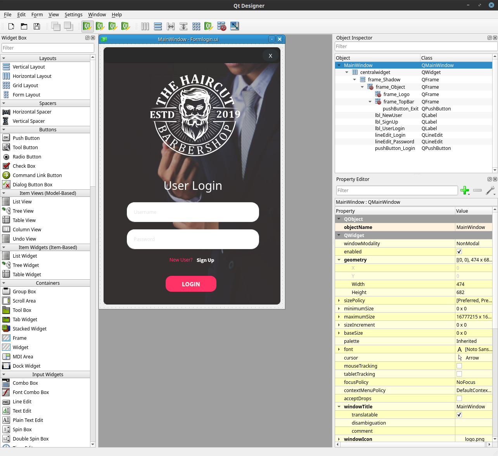
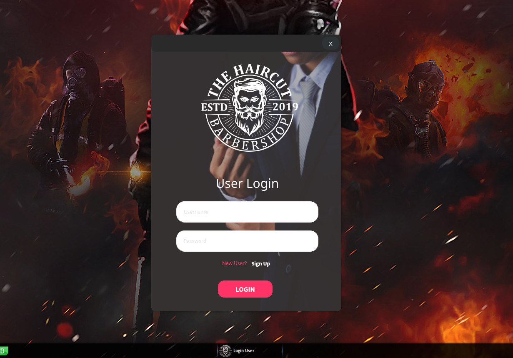

# Form LoginBarberShop in PySide2 
[](https://www.python.org/)
[]()
[]()

--
This is the study of an interface with PySide2 /
Python - Login - Modern Gui [Qt Designer, PySide2/PyQt5] 

## Using Qt Designer
Qt Designer is the Qt tool for designing and building graphical user interfaces (GUIs) with Qt Widgets. You can compose and customize your windows or dialogs in a what-you-see-is-what-you-get (WYSIWYG) manner, and test them using different styles and resolutions.


Qt Designer: https://doc.qt.io/qt-5/qtdesigner-manual.html

## Use
```
$ python main.py
```

## Files
```bash
.
├── assets
│   ├── files.py
│   ├── files.qrc
│   ├── img
│   │   ├── bg.jpg
│   │   ├── bg.xcf
│   │   ├── logo.png
│   │   └── logo.svg
│   ├── __init__.py
│   └── prints
│       ├── form.png
│       └── qt.png
├── Formlogin.ui
├── LICENSE
├── main.py
├── README.md
└── ui_Formlogin.py

3 directories, 14 files
```

## Remove title bar
```python
self.setWindowFlag(Qt.FramelessWindowHint)
self.setAttribute(Qt.WA_TranslucentBackground)
```

## Set drop shadow effect
```python
self.shadow = self.set_drop_shadow()
def set_drop_shadow(self):
    self.shadow = QGraphicsDropShadowEffect(self)
    self.shadow.setBlurRadius(20)
    self.shadow.setXOffset(0)
    self.shadow.setYOffset(0)
    self.shadow.setColor(QColor(0, 0, 0, 60))
    return self.shadow
```
# My study reference
- https://stackoverflow.com/questions/4663207/masking-qlineedit-text
- https://github.com/Wanderson-Magalhaes/Python_PySide2_Custom_Title_Bar2
- https://gis.stackexchange.com/questions/293285/problem-converting-qrc-file-into-py-one-by-pyqt5
- https://i.imgur.com/CqxnlE2.jpeg

